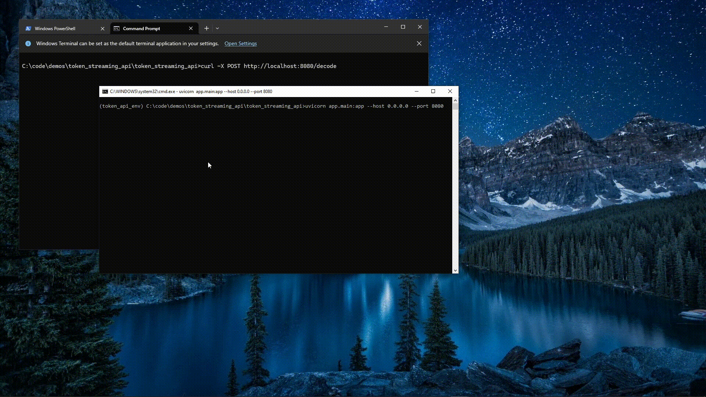
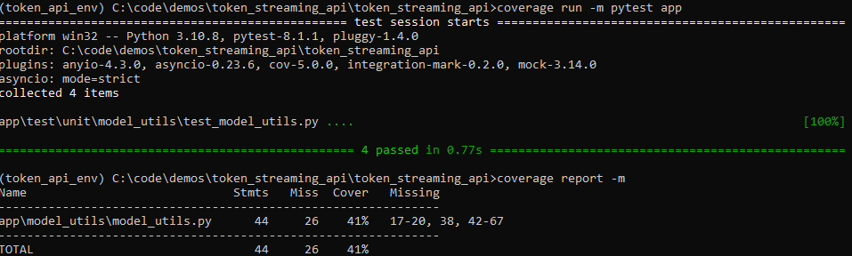

# Token Streaming API Demo

## Description

This is a FastAPI HTTP service that uses the HuggingFace tokenizer to encode text and subsequently decode those tokens back into text.
The full description of the take-home assignment is available at `https://www.notion.so/cohereai/Token-Streaming-API-Interview-Mihai-Burcea-4-2-2024-e90d9ad13c6342afa3ced37496bc6859?pvs=4`.

## Usage

This is a FastAPI service. To run it locally, follow these steps:

1. Install the requirements: `pip install -r requirements.txt`
2. Start the server: `uvicorn app.main:app --host 0.0.0.0 --port 8080 --reload` (you may omit the `--reload` parameter)
3. Send requests to the server using your preferred tool (e.g., curl in some terminal, Postman, Insomnia, Bruno, etc).

You can also run the service in a browser: go to `http://localhost:8080/docs` and follow the intuitive SwaggerUI interface to send requests to the endpoints and observe the responses received. This UI will also show you the existing endpoints and the parameters that can be added to requests made to these endpoints.

### Features

The service supports all features requested in the problem statement:
- `stop_sequences`: the generated text will be cut at the end of the earliest occurrence of a stop sequence. The sequence will be included the generated text.
- `end_sequences`: works like `stop_sequences`, but excludes the string from the returned result.
- supports unicode emoji: please see screenshot in the [Streaming section](#streaming).

#### Additional Features

The service has two endpoints: `/decode` and `/encode`. By default, if the `/decode` endpoint is called without making a request to the `/encode` endpoint, the token generator will use some predefined, hardcoded text, specifically: `Hello, world! 😄`.
If one makes a call to the `/encode` endpoint with some text as a parameter, then that text will be used from that point onwards by the token generator, and all subsequent calls to the `/decode` endpoint will return the text decoded from the string provided to the `/encode` endpoint previously.

Here are some examples for clarification:

1. The `/encode` endpoint is never called; then a call to the `/decode` endpoint will return the predefined text: `Hello, world! 😄`.
2. Call the `/encode` endpoint with text `foo`; now all subsequent calls to the `/decode` endpoint will return `foo` (until a request to `/encode` is made again with a different string).
3. Call the `/encode` endpoint with text `bar`; now all subsequent calls to the `/decode` endpoint will return `bar` (until a request to `/encode` is made again with a different string).

### Streaming

While one can inspect the code to see that the `/decode` endpoint does indeed return a [StreamingResponse] (https://fastapi.tiangolo.com/advanced/custom-response/#streamingresponse), I've tried several methods to observe it visually.
Here are my findings:

- Windows default console terminal (cmd.exe): shows streaming (words appear one by one), but does not support unicode by default.
- Windows Terminal (from the Microsoft Store): supports unicode and can emulate several other terminals, but does not show the actual streaming of words - all words appear at once. This may also be due to curl and its sometimes weird behavior in Windows.
- MacOS terminal: supports unicode, but does not show the actual streaming, the entire output appears all at once.
- Postman: supports unicode, but does not show the actual streaming, the entire output appears all at once.



### Long Demo using Postman

I made a clip available in the repo under `/demo_assets/postman_demo.mp4`; in it, you can see the following actions:

- I start the uvicorn server
- I make a Postman request to the `/decode` endpoint; because no previous queries were made to the `/encode` endpoint, the token generator uses its default text (`Hello, world! 😄`), which will be returned as a streamed response.
- Next, I make a Postman request to the `/encode` endpoint with the text `"Hello, world! This is an example text 2."`. This requests sets this text to be used by the token generator in subsequent calls to the `/decode` endpoint.
- Next, I make a Postman request to the `/decode` endpoint. Because we previously called the `/encode` endpoint, the token generator will generate the text we provided in the call to the `/encode` endpoint. However, because we are also providing `stop_sequences` and the word `example` is part of the `stop_subsequences`, the token generation (and the response we receive) halts _after_ the word `example`.
- Next, I update the `end_sequences` in the request body of the call to the `/decode` endpoint, by making the word `an` part of `end_sequences`. This causes the response to cut off _before_ the word `an`, i.e., the response will be `"Hello, world! This is`.


### Test Coverage

#### Unit Tests

I wrote a few unit tests using pytest. I did not aim for 100% unit test coverage, as one would in production, because this is just a demo.
The few tests are provided just as a proof-of-concept. See screenshot below for unit test coverage.



#### Integration Tests

While these can also be written in pytest, I only provided a few written in Postman. The Postman collection and environment are
available in the repository under `app/test/integration/postman`.
Again as a proof of concept, one of the Postman requests (`Decode_01_SUCCESS`) has a simple test of its own, that verifies that the response is the expected output:

```
pm.test("Body matches string", function () {
    pm.expect(pm.response.text()).to.include("Hello, world! This is");
});
```
In the demo clip I provided in this repo under `/demo_assets/postman_demo.mp4`, you can see that this test passes when we execute the request (it fails the first time because prior to calling the `/encode` endpoint, the token generator uses its default text).
